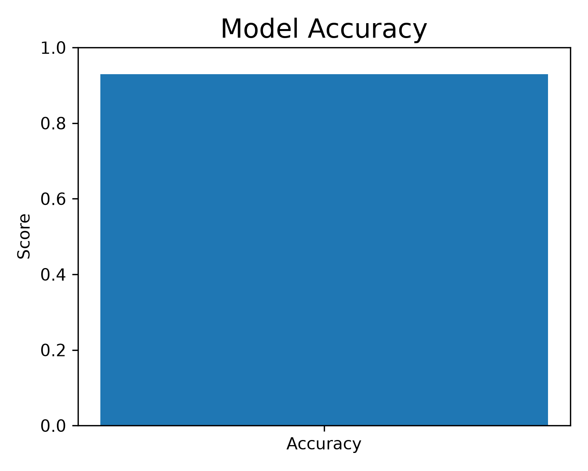
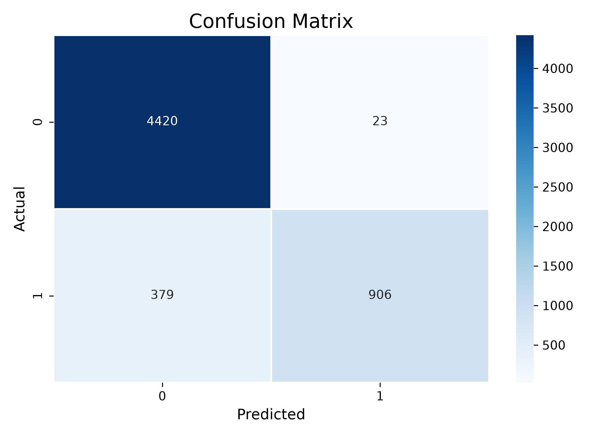
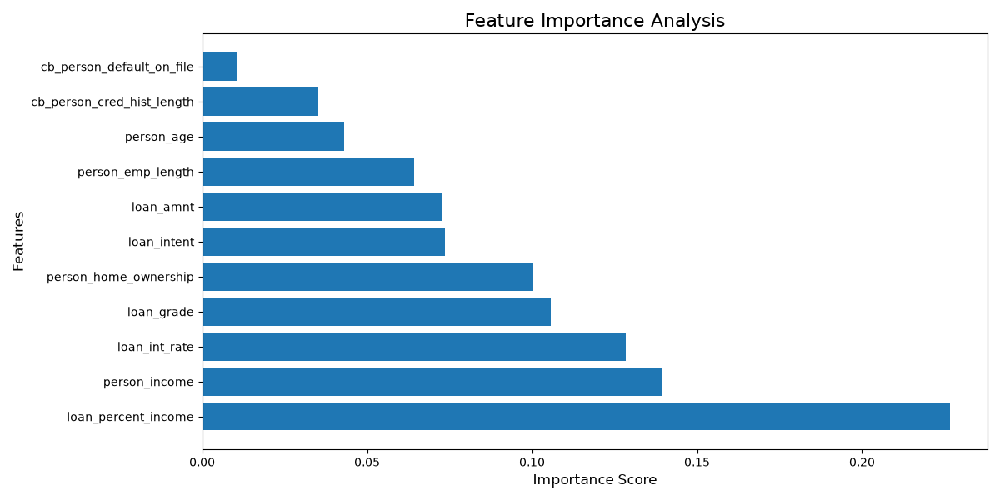

# Credit Risk Prediction using Machine Learning

# Overview
This project predicts whether a loan applicant is likely to be a credit risk using Machine Learning.

# Technologies Used
* Python
* Pandas
* Matplotlib
* Seaborn
* Scikit-Learn

# Machine Learning Model
* Random Forest Classifier

# Project Workflow
1. Data Loading
2. Data Preprocessing
3. Exploratory Data Analysis
4. Label Encoding
5. Model Training
6. Model Evaluation
7. Feature Importance Analysis

# Results
# Accuracy Graph

# Confusion Matrix

# Feature Importance

# Author
Nikhil Singh
